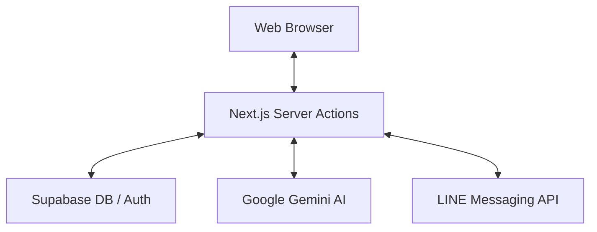

# 🛠️ คู่มือทางเทคนิคและฐานข้อมูล (Technical & Database Guide)

รายละเอียดการติดตั้ง โครงสร้างฐานข้อมูล และผังการทำงานของระบบ Real Estate CRM

---

## 1. การติดตั้งและตั้งค่าระบบ (Technical Setup)

### ความต้องการของระบบ (Prerequisites)

- Node.js 20.x+, npm หรือ pnpm
- Supabase Account, Gemini API Key, LINE Messaging API

### ตัวแปรสภาพแวดล้อม (.env)

- `NEXT_PUBLIC_SUPABASE_URL` / `API_KEY`
- `LINE_CHANNEL_ACCESS_TOKEN` / `SECRET`
- `GEMINI_API_KEY`

---

## 2. โครงสร้างฐานข้อมูล (Database Schema)

ระบบใช้ Supabase (PostgreSQL) พร้อมฟีเจอร์ **RLS (Row Level Security)** เพื่อความปลอดภัย:

- **`properties`**: เก็บข้อมูลทรัพย์สินและสถานะ
- **`leads`**: เก็บข้อมูลผู้สนใจและความต้องการ (Hot/Cold)
- **`deals`**: บันทึกการเจรจาและการปิดงาน
- **`profiles`**: ข้อมูลพนักงานและระดับสิทธิ์ (Admin/Agent)
- **Storage**: แยก Bucket สำหรับรูปภาพ (`property-images`) และเอกสาร (`documents`)

---

## 3. ผังการทำงานหลัก (Architecture & Workflow)

### 🔄 Data Flow Overview

### 🧠 Workflow สำคัญ

1.  **Lead Capture:** ลูกค้าทัก → บันทึกลง CRM → แจ้งเตือนเข้า LINE นายหน้า
2.  **AI Writing:** นายหน้าพิมพ์ข้อมูลย่อ → AI เจนคำบรรยาย 3 ภาษา → บันทึกหน้าขาย
3.  **Smart Match:** ลูกค้าตอบ Wizard → ระบบคำนวณคะแนน → แนะนำทรัพย์ที่ตรงใจ

---
