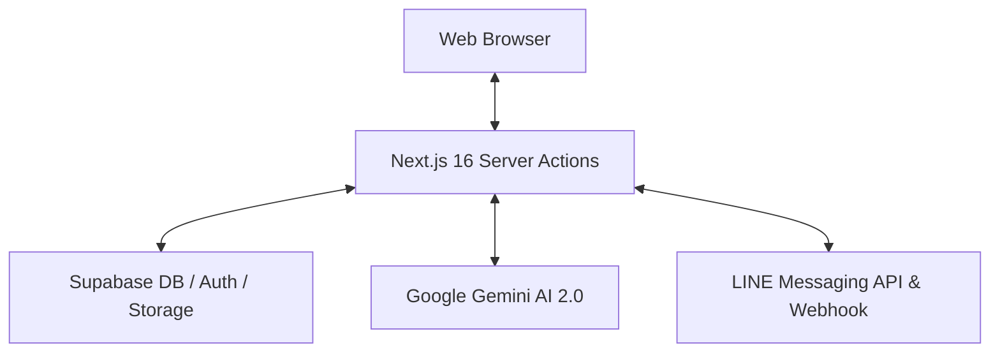

# 🛠️ คู่มือทางเทคนิคและฐานข้อมูล (Technical & Database Guide)

รายละเอียดการติดตั้ง โครงสร้างฐานข้อมูล และผังการทำงานของระบบ Real Estate CRM

---

## 1. การติดตั้งและตั้งค่าระบบ (Technical Setup)

### ความต้องการของระบบ (Prerequisites)

- Node.js 22.x+, npm หรือ pnpm
- Supabase Account, Gemini API Key, LINE Messaging API

### ตัวแปรสภาพแวดล้อม (.env)

- `NEXT_PUBLIC_SUPABASE_URL` / `API_KEY`
- `LINE_CHANNEL_ACCESS_TOKEN` / `SECRET`
- `LINE_ADMIN_USER_ID` (สำหรับรับแจ้งเตือน)
- `GEMINI_API_KEY`

---

## 2. โครงสร้างฐานข้อมูล (Database Schema)

ระบบใช้ Supabase (PostgreSQL) พร้อมฟีเจอร์ **RLS (Row Level Security)** เพื่อความปลอดภัย:

- **`properties`**: เก็บข้อมูลทรัพย์สิน พร้อมฟีเจอร์ Multi-language (TH, EN, CN)
- **`leads`**: เก็บข้อมูลผู้สนใจ เชื่อมต่อกับระบบ Omni-channel PSID
- **`omni_messages`**: รวมประทวัติแชทจาก LINE, FB, Website ไว้ที่เดียว
- **`audit_logs`**: บันทึกกิจกรรมของ Agent และ Admin เพื่อความโปร่งใส
- **`ai_usage_logs`**: ติดตามการใช้งาน Token ของระบบ AI
- **Storage**: แยก Bucket สำหรับรูปภาพ (`properties`), เอกสาร (`documents`), และรูปโปรไฟล์ (`avatars`)

---

## 3. ผังการทำงานหลัก (Architecture & Workflow)

### 🔄 Data Flow Overview

```mermaid
graph TD
    Client[Web Browser] <--> NextJS[Next.js 16 Server Actions]
    NextJS <--> Supabase[Supabase DB / Auth / Storage]
    NextJS <--> Gemini[Google Gemini AI 2.0]
    NextJS <--> LINE[LINE Messaging API & Webhook]
```

### 🧠 Workflow สำคัญ

1.  **Lead Capture (Omni-channel):** ลูกค้าทักจาก LINE/Web → บันทึกลง CRM → แจ้งเตือนเข้า LINE นายหน้า → ตอบกลับได้ทันทีจาก Dashboard
2.  **AI Smart Interaction:** ระบบ Chatbot ค้นหาทรัพย์สินอัตโนมัติ และระบบแปลภาษา 3 ภาษาแบบ Real-time
3.  **Enterprise Security:** การทำ Audit Trail บันทึกทุกการแก้ไขข้อมูลสำคัญ และ RLS ป้องกันการเข้าถึงข้อมูลข้ามเขตสิทธิ์

---
