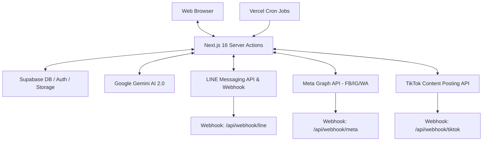

# 🛠️ คู่มือทางเทคนิคและฐานข้อมูล (Technical & Database Guide)

รายละเอียดการติดตั้ง โครงสร้างฐานข้อมูล และผังการทำงานของระบบ Real Estate CRM

> **อัปเดตล่าสุด:** 25 กุมภาพันธ์ 2026

---

## 1. การติดตั้งและตั้งค่าระบบ (Technical Setup)

### ความต้องการของระบบ (Prerequisites)

- Node.js 22.x+, npm หรือ pnpm
- Supabase Account, Gemini API Key, LINE Messaging API
- Meta (Facebook) Developer Account (สำหรับ FB/IG/WhatsApp)
- TikTok Developer Account (สำหรับ TikTok Content Posting)

### ตัวแปรสภาพแวดล้อม (.env)

```env
# Supabase
NEXT_PUBLIC_APP_URL=https://your-domain.com
NEXT_PUBLIC_SUPABASE_URL=your_supabase_url
NEXT_PUBLIC_SUPABASE_PUBLISHABLE_KEY=your_anon_key
SUPABASE_SERVICE_ROLE_KEY=your_service_role_key

# LINE Messaging API
LINE_CHANNEL_ACCESS_TOKEN=your_line_token
LINE_CHANNEL_SECRET=your_line_secret

# AI Gemini
GEMINI_API_KEY=your_gemini_api_key

# Meta App Credentials (Facebook / Instagram / WhatsApp)
META_APP_ID=your_meta_app_id
META_APP_SECRET=your_meta_app_secret
META_PAGE_ACCESS_TOKEN=your_page_access_token
META_VERIFY_TOKEN=your_webhook_verify_token

# TikTok Integration
TIKTOK_CLIENT_KEY=your_tiktok_client_key
TIKTOK_CLIENT_SECRET=your_tiktok_client_secret
TIKTOK_REDIRECT_URI=https://your-domain.com/api/auth/callback/tiktok

# Google OAuth (Optional)
GOOGLE_CLIENT_ID=your_google_client_id
GOOGLE_CLIENT_SECRET=your_google_client_secret
```

---

## 2. โครงสร้างฐานข้อมูล (Database Schema)

ระบบใช้ Supabase (PostgreSQL) พร้อมฟีเจอร์ **RLS (Row Level Security)** เพื่อความปลอดภัย:

- **`properties`**: เก็บข้อมูลทรัพย์สิน พร้อมฟีเจอร์ Multi-language (TH, EN, CN) และคอลัมน์ติดตามการโพสต์: `posted_to_facebook_at`, `posted_to_instagram_at`, `posted_to_tiktok_at`, `posted_to_line_at`
- **`leads`**: เก็บข้อมูลผู้สนใจ เชื่อมต่อกับระบบ Omni-channel PSID
- **`teams`**: เก็บข้อมูลรายชื่อทีมขายและหัวหน้าทีม (Manager)
- **`omni_messages`**: รวมประวัติแชทจาก LINE, Facebook Messenger, Instagram DM, WhatsApp ไว้ที่เดียว
- **`audit_logs`**: บันทึกกิจกรรมของ Agent และ Admin รวมถึงประวัติการโอนย้ายงาน (Lead Transfer) และ Social Posting
- **`ai_usage_logs`**: ติดตามการใช้งาน Token ของระบบ AI
- **`site_settings`**: เก็บค่าตั้งค่าระบบรวมถึง `tiktok_auth_token`, `social_post_template`, `keyword_automation`
- **`rental_contracts`**: จัดการสัญญาเช่าและแจ้งเตือนค่าเช่ารายเดือน
- **Storage**: แยก Bucket สำหรับรูปภาพ (`properties`), เอกสาร (`documents`), รูปโปรไฟล์ (`avatars`), และ Site Assets (`site`)

---

## 3. ผังการทำงานหลัก (Architecture & Workflow)

### 🔄 Data Flow Overview


```mermaid
graph TD
    Client[Web Browser] <--> NextJS[Next.js 16 Server Actions]
    NextJS <--> Supabase[Supabase DB / Auth / Storage]
    NextJS <--> Gemini[Google Gemini AI 2.0]
    NextJS <--> LINE[LINE Messaging API & Webhook]
    NextJS <--> Meta[Meta Graph API - FB/IG/WA]
    NextJS <--> TikTok[TikTok Content Posting API]
    Meta --> WebhookMeta[Webhook: /api/webhook/meta]
    TikTok --> WebhookTT[Webhook: /api/webhook/tiktok]
    LINE --> WebhookLINE[Webhook: /api/webhook/line]
    Cron[Vercel Cron Jobs] --> NextJS
```

### 🧠 Workflow สำคัญ

1.  **Lead Capture (Omni-channel):** ลูกค้าทักจาก LINE/FB Messenger/IG DM/Web → บันทึกลง CRM → แจ้งเตือนเข้า LINE นายหน้า → ตอบกลับได้ทันทีจาก Dashboard
2.  **Agent Isolation & Team Flow:** Admin ตั้งค่าความปลอดภัย → ระบบแยกข้อมูลให้อัตโนมัติ (Agent เห็นเฉพาะของตัวเอง / Manager เห็นทั้งทีม / Admin เห็นทั้งหมด)
3.  **AI Smart Interaction:** ระบบ Chatbot ค้นหาทรัพย์สินอัตโนมัติ และระบบแปลภาษา 3 ภาษาแบบ Real-time
4.  **Social Media Automation:** โพสต์ทรัพย์ลง FB/IG/TikTok จาก CRM → ลูกค้าคอมเมนต์ → Keyword Automation ส่ง DM อัตโนมัติ
5.  **Enterprise Security:** การทำ Audit Trail บันทึกทุกการแก้ไขข้อมูลสำคัญ และ RLS ป้องกันการเข้าถึงข้อมูลข้ามเขตสิทธิ์แบบ 100%
6.  **Cron Automation:** ระบบตรวจสอบสัญญาหมดอายุ, แจ้งเตือนค่าเช่ารายเดือน, ลบข้อมูลขยะอัตโนมัติ

### 📡 API & Webhook Endpoints

| Endpoint                       | หน้าที่                                   |
| :----------------------------- | :---------------------------------------- |
| `/api/webhook/line`            | รับ Events จาก LINE Messaging API         |
| `/api/webhook/meta`            | รับ Events จาก Facebook/Instagram Webhook |
| `/api/webhook/tiktok`          | รับ Events จาก TikTok API                 |
| `/api/cron/contract-expiry`    | ตรวจสอบสัญญาหมดอายุ (Scheduled)           |
| `/api/cron/rent-notifications` | แจ้งเตือนค่าเช่ารายเดือน (Scheduled)      |
| `/api/cron/trash-cleanup`      | ลบข้อมูลขยะอัตโนมัติ (Scheduled)          |
| `/api/syndication/feed`        | XML Feed สำหรับเผยแพร่ทรัพย์ไปเว็บภายนอก  |
| `/api/auth/callback/tiktok`    | TikTok OAuth Callback                     |

---
