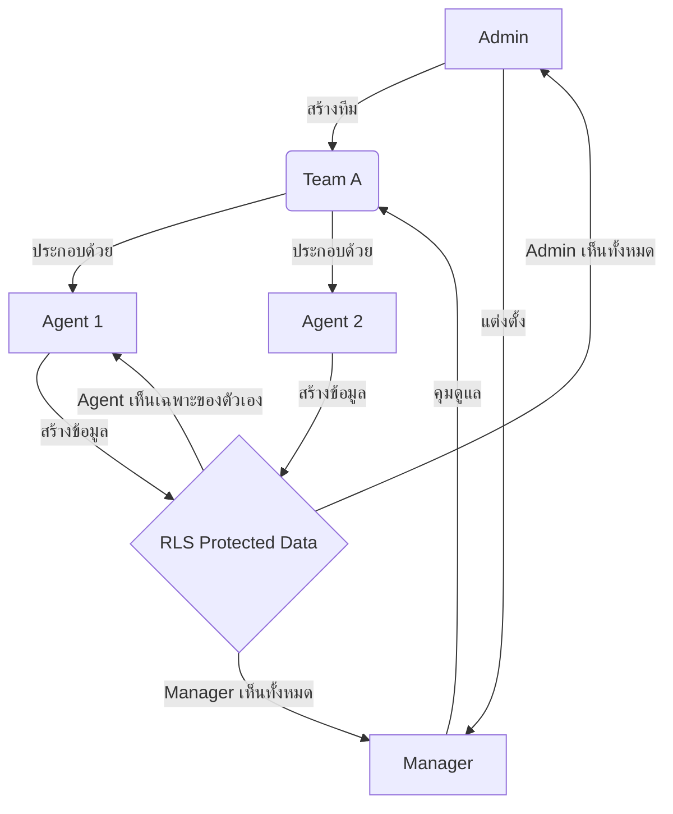

# 🏢 คู่มือระบบบริหารจัดการทีมและสิทธิ์การเข้าถึง (Enterprise Edition)

เอกสารฉบับนี้จัดทำขึ้นเพื่อให้ข้อมูลเกี่ยวกับระบบโครงสร้างบทบาท (Roles) และการแยกส่วนข้อมูล (Agent Isolation) ซึ่งเป็นหนึ่งในจุดขายสูงสุด (Unique Selling Point) ของ Real Estate CRM สำหรับลูกค้าระดับองค์กร

> **อัปเดตล่าสุด:** 25 กุมภาพันธ์ 2026

---

## 🏗️ โครงสร้างบทบาท (Hierarchy & Roles)

ระบบ CRM ของเราถูกออกแบบมาเพื่อรองรับบริษัทอสังหาฯ ที่มีทีมงานขนาดใหญ่ โดยแบ่งสิทธิ์ออกเป็น 4 ระดับหลัก:

| บทบาท (Role)   | สิทธิ์การเข้าถึง           | หน้าที่หลัก                                                                               |
| :------------- | :------------------------- | :---------------------------------------------------------------------------------------- |
| **👑 ADMIN**   | **สูงสุด (Overrule)**      | ควบคุมระบบทั้งหมด, ตั้งค่าความปลอดภัย, จัดการเพิ่ม/ลดพนักงาน, ดูข้อมูลได้ทุกอย่างในบริษัท |
| **🛡️ MANAGER** | **หัวหน้าทีม (Team Lead)** | จัดการสมาชิกในทีมของตนเอง, ดูสถิติและข้อมูล (Leads/Deals) ของลูกทีมทุกคนได้               |
| **👤 AGENT**   | **ผู้ปฏิบัติงาน (Agent)**  | จัดการเฉพาะข้อมูลที่ตนเองสร้างหรือได้รับมอบหมายเท่านั้น (ในกรณีที่เปิดโหมด Isolation)     |
| **🌐 USER**    | **สาธารณะ (Client)**       | ลูกค้าทั่วไปที่ใช้งานหน้าเว็บ (ไม่มีสิทธิ์เข้าหลังบ้าน)                                   |

---

## 🔒 ระบบแยกส่วนข้อมูล (Enterprise Agent Isolation)

นี่คือฟีเจอร์ที่ช่วย "ปกป้องทรัพย์สินทางปัญญา" ของบริษัท โดยเจ้าของบริษัท (Admin) สามารถเลือกเปิด/ปิดการแยกส่วนข้อมูลได้ 3 ระดับ:

### 1. แยกฐานข้อมูลทรัพย์สิน (Properties Isolation)

- **เมื่อเปิดใช้งาน:** Agent คนที่ 1 จะไม่เห็น "ทรัพย์ปิด" หรือรายชื่อเจ้าของทรัพย์ที่ Agent คนที่ 2 หามาได้
- **ประโยชน์:** ป้องกันการขโมยรายชื่อ Listing ข้ามทีมภายในบริษัท

### 2. แยกฐานข้อมูลลูกค้า (Leads Isolation)

- **เมื่อเปิดใช้งาน:** รายชื่อลูกค้าที่แอดไลน์มาหา Agent A จะถูกเก็บเป็นความลับ Agent B จะไม่เห็นข้อมูลติดต่อ
- **ประโยชน์:** รักษาความเป็นส่วนตัวของฐานลูกค้า และป้องกันการแย่งลูกค้ากันเอง

### 3. แยกฐานข้อมูลการขาย (Deals Isolation)

- **เมื่อเปิดใช้งาน:** ข้อมูลรายได้ คอมมิชชั่น และสถานะสัญญา จะเห็นเฉพาะเจ้าของเคสและหัวหน้าทีมเท่านั้น
- **ประโยชน์:** ปกป้องข้อมูลทางการเงินและความลับทางธุรกิจ

---

## 👥 ระบบจัดการทีม (Team Management Flow)

ระบบรองรับการสร้าง "ทีมขาย" (เช่น ทีมสุขุมวิท, ทีมคอนโดปล่อยเช่า) โดยมี Workflow ดังนี้:

> [!IMPORTANT]
> **ความปลอดภัยระดับสูงสุด (Database RLS)**
> ความภูมิใจของระบบเราคือการใช้เทคโนโลยี **Row-Level Security (RLS)** ซึ่งเป็นการล็อคข้อมูลที่ระดับฐานข้อมูลจริงๆ ไม่ใช่แค่การซ่อนหน้าจอ ทำให้แม้แต่โปรแกรมเมอร์ที่พยายามแฮกผ่าน API ก็ไม่สามารถเห็นข้อมูลข้ามสิทธิ์ได้

---

## 🔄 ระบบโอนย้ายงาน (Bulk Lead Transfer)

เมื่อมี Agent ลาออก หรือต้องการย้ายสายงาน Admin/Manager สามารถใช้ระบบ **"โอนย้ายงานอัจฉริยะ"** ได้:

- **Bulk Action**: เลือก Lead 5-10 คนแล้วโอนให้ Agent คนใหม่ได้ในคลิกเดียว
- **Full History**: ประวัติกิจกรรม (Activities) และดีล (Deals) เดิมจะตามไปด้วยทั้งหมด
- **Audit Logs**: ทุกการโอนย้ายจะถูกบันทึกประวัติไว้ตรวจสอบย้อนหลังได้ว่าใครเป็นคนย้ายงาน
- **Social Post Audit**: การโพสต์ทรัพย์ลง Social Media (FB/IG/TikTok) จะถูกบันทึกใน Audit Logs ด้วย

---

## 💡 จุดเด่นสำหรับการขาย (Selling Points)

1. **พรีเมียมและเป็นมืออาชีพ**: ระบบแยกสิทธิ์ชัดเจนเหมือน CRM ราคาแพงระดับโลก (เช่น Salesforce หรือ HubSpot)
2. **ขยายตัวง่าย (Scalability)**: ไม่ว่าบริษัทจะมี Agent 10 คน หรือ 1,000 คน ระบบสามารถสร้างทีมรองรับได้ไม่จำกัด
3. **ลดความขัดแย้ง**: ป้องกันปัญหาการแย่งลูกค้าหรือการนำข้อมูลออกไปใช้ส่วนตัวได้จริง
4. **Dashboard ภาพรวม**: หัวหน้าเห็น Performance รายคนและรายทีมได้ทันทีจากจุดเดียว

---
