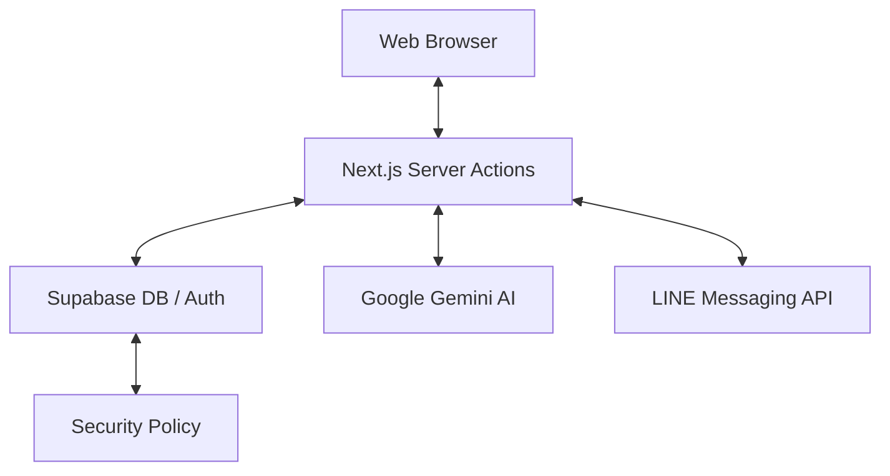

# 🔄 Architecture & Workflow (ผังการทำงานหลักของระบบ)

อธิบายการทำงานร่วมกันของเทคโนโลยีต่างๆ และลำดับขั้นตอนสำคัญ (Workflow) ในระบบ

---

## 1. ระบบจัดการลูกค้าใหม่ (Lead Workflow)

หัวใจสำคัญของ CRM คือการไม่พลาดการติดต่อจากลูกค้า:

1.  **Lead Capture:** ลูกค้ากรอกฟอร์มหน้าเว็บ หรือทักผ่าน LINE Bot
2.  **Notification:** ระบบส่งแจ้งเตือน (LINE Flex Message) ไปยังกลุ่มนายหน้าทันที
3.  **CRM Entry:** ข้อมูลถูกบันทึกลงฐานข้อมูล Supabase อัตโนมัติ
4.  **Follow-up:** นายหน้าบันทึก Activity (โทร, นัดชม) ในระบบ เพื่อเปลี่ยนสถานะ Lead จาก New → Closed

---

## 2. ระบบ AI-Powered Content (AI Workflow)

การใช้ AI เพื่อลดภาระงานของนายหน้า:

1.  **Input:** นายหน้ากรอกรายละเอียดทรัพย์แบบย่อๆ (เช่น 3 นอน 2 น้ำ สภาพใหม่ ใกล้ BTS)
2.  **AI Processing:** ระบบส่งข้อมูลไปยัง Google Gemini AI พร้อม Prompt ที่ปรับจูนมาเฉพาะ
3.  **Output:** AI ส่งคำบรรยายที่สละสลวยทั้งภาษาไทยและอังกฤษกลับมา
4.  **Verification:** นายหน้าตรวจสอบและกดบันทึกเพื่อใช้เป็นหน้าขายทรัพย์ทันที

---

## 3. ระบบจับคู่อัจฉริยะ (Smart Match Workflow)

1.  **Questionnaire:** ลูกค้าทำแบบสอบถามผ่าน Smart Match Wizard
2.  **Scoring:** ระบบนำความต้องการ (งบ, ทำเล, ประเภท) มาคำนวณคะแนนกับทรัพย์ที่มีในคลัง
3.  **Recommendation:** แสดงรายการทรัพย์ที่ "ตรงใจ" ที่สุด 3-5 รายการแรก
4.  **Conversion:** ลูกค้ากดถูกใจหรือติดต่อสอบถามจากหน้านั้นได้ทันที

---

## 4. โครงสร้างการส่งข้อมูล (Data Flow)

---
