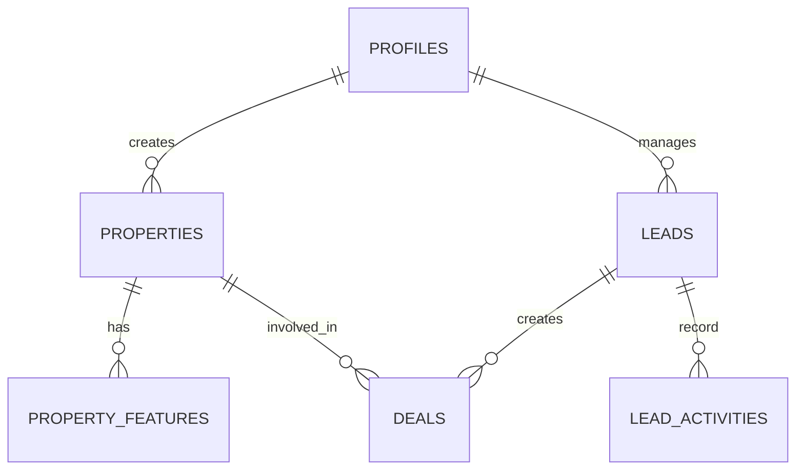

# 🗄️ Database Schema & Security (โครงสร้างฐานข้อมูลและความปลอดภัย)

รายละเอียดโครงสร้างข้อมูลและนโยบายการรักษาความปลอดภัยของระบบ Real Estate CRM

---

## 1. ตารางหลัก (Core Tables)

### `properties` (ข้อมูลทรัพย์สิน)

- เก็บข้อมูลรายละเอียดบ้าน/คอนโด, ราคา, พื้นที่, และสถานะการขาย/เช่า
- เชื่อมโยงกับ `owners` และ `property_features`

### `leads` (ข้อมูลลูกค้า)

- เก็บข้อมูลผู้สนใจ, ความต้องการ (Budget, Area), และแหล่งที่มา (Facebook, LINE)
- มี `lead_stage` เพื่อติดตามสถานะ (New, Contacted, Viewed, Negotiating, Closed)

### `deals` (ข้อมูลการทำรายการ)

- เชื่อมโยง `leads` เข้ากับ `properties` เพื่อบันทึกการเจรจา
- เก็บยอดเงินยอดขาย/เช่า และค่าคอมมิชชัน

### `profiles` (ข้อมูลผู้ใช้ระบบ)

- เก็บข้อมูลพนักงาน (Admin, Agent) พร้อมระดับสิทธิ์ (Role)

---

## 2. ความปลอดภัยข้อมูล (Security & RLS)

ระบบใช้ **Row Level Security (RLS)** ของ Supabase เพื่อควบคุมการเข้าถึงข้อมูลในระดับฐานข้อมูล:

- **Public Access:** ผู้เข้าชมเว็บทั่วไปสามารถอ่าน (SELECT) ข้อมูลทรัพย์สินที่มีสถานะ `ACTIVE` เท่านั้น
- **Agent Access:** นายหน้าสามารถดูและแก้ไขข้อมูลที่ตนเองเป็นเจ้าของ (Lead/Property) ได้ตามสิทธิ์ที่ได้รับ
- **Admin Access:** ผู้จัดการระบบสามารถเข้าถึงและแก้ไขข้อมูลได้ทุกตาราง

---

## 3. ระบบจัดการไฟล์ (Storage)

ระบบจัดเก็บรูปภาพและเอกสารแยกเป็น Bucket:

- `property-images`: สำหรับรูปภาพบ้านและคอนโด (มีระบบบีบอัดรูปก่อนอัปโหลด)
- `documents`: สำหรับไฟล์สัญญาและสำเนาบัตรประชาชน (มีการป้องกันการเข้าถึงจากบุคคลภายนอก)

---

## 4. แผนผังความสัมพันธ์ (ER Diagram Concept)

---
