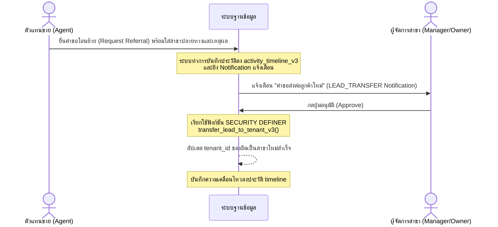

# 🏢 05: ปฏิบัติการระดับองค์กรและโครงสร้างสิทธิ์ (V3 Enterprise Roles & Permissions Matrix)

> **โครงสร้างสถาปัตยกรรม:** Multi-Tenant Architecture, Row-Level Security (RLS), Role-Based Access Control (RBAC)
> **เป้าหมาย:** สานต่อรูปแบบบริษัทอสังหาริมทรัพย์ที่มีหลายสาขา (Multi-Branch) โดยควบคุมการแยกแยะข้อมูล (Branch Isolation) การป้องกันข้อมูลรั่วไหล (Data Leakage Prevention) และความยืดหยุ่นในการทำ Co-Broke ข้ามสาขาได้อย่างปลอดภัยและโปร่งใส

---

## 1. การควบคุมการเข้าถึงข้อมูล (Data Isolation & RLS Architecture)

ระบบใช้งานสถาปัตยกรรม **Tenant-first** ผ่านฐานข้อมูล PostgreSQL ที่ถูกติดตั้ง Row-Level Security (RLS) อย่างรัดกุม โดยทุกข้อมูลสำคัญจะมีฟิลด์ `tenant_id` สำหรับระบุความเป็นเจ้าของสาขา

* **Intra-Branch Isolation:** ผู้ใช้ในสาขา A จะเข้าถึง ค้นหา หรือจัดการข้อมูลผู้ป่วย, ลีด, ทรัพย์ และดีลของสาขา A เท่านั้น หากพยายามยิง API หรือระบุ URL ข้ามไปยังสาขา B ระบบ RLS จะทำการกรองคิวรีออกทันที เสมือนไม่มีข้อมูลนั้นอยู่จริง (404 Not Found)
* **Performance Hardening:** RLS ในเวอร์ชัน V3 ถูกออกแบบให้เรียกใช้ฟังก์ชันแบบ `STABLE` เช่น `public.is_tenant_member(tenant_id)` หรือ `public.is_system_admin()` ตรงๆ โดยไม่มีการคลุมด้วย Subquery Subplans ย่อย ช่วยให้ PostgreSQL Optimizer สามารถใช้ดัชนี (Indexes) ค้นหาได้อย่างรวดเร็วและใช้ CPU ทรัพยากรอย่างคุ้มค่าสูงสุด

---

## 2. ตารางสรุปสิทธิ์การเข้าใช้งาน (V3 Permission Matrix Table)

| ขอบเขตงาน / ฟังก์ชัน | ADMIN (SuperAdmin) | OWNER (Tenant Owner) | MANAGER (Tenant Manager) | AGENT (Tenant Agent) | USER (Public Client) |
| :--- | :---: | :---: | :---: | :---: | :---: |
| **สลับดูข้อมูลทุกสาขา (Global Switcher)** | ✅ | ❌ | ❌ | ❌ | ❌ |
| **ตั้งค่าระบบส่วนกลาง (Global Settings)** | ✅ | ❌ | ❌ | ❌ | ❌ |
| **อนุมัติเปิดสาขาใหม่ (Approve Tenant)** | ✅ | ❌ | ❌ | ❌ | ❌ |
| **จัดการทีมงานและตำแหน่งในสาขา** | ✅ | ✅ | ❌ | ❌ | ❌ |
| **ดูรายงานการเงินรวมของสาขา** | ✅ | ✅ | ✅ | ❌ | ❌ |
| **โอนย้ายทรัพย์/ลีดข้ามสาขาทันที (Instant Transfer)**| ✅ | ✅ | ✅ | ❌ | ❌ |
| **ส่งคำขอโอนย้ายข้ามสาขา (Referral Request)** | - | - | - | ✅ | ❌ |
| **จัดการทรัพย์/ลีด/ดีล ภายในสาขา** | ✅ | ✅ | ✅ | ✅ *(เฉพาะที่ได้รับมอบหมาย)*| ❌ |
| **ดูข้อมูลหน้าบ้านสาธารณะ (Public Search)** | ✅ | ✅ | ✅ | ✅ | ✅ |

---

## 3. รายละเอียดหน้าที่ของแต่ละบทบาท (Detailed Role Directory)

### 3.1 ADMIN (แอดมินระบบหลักส่วนกลาง / SuperAdmin)
* **ขอบเขตอำนาจ:** สิทธิ์สูงสุดและข้ามสาขาได้อิสระ 100% (Bypass RLS)
* **หน้าที่หลัก:**
  * ควบคุมดูแลโครงสร้างพื้นฐานระบบ, ข้อมูล Master Data (เช่น รายชื่อแบรนด์, รายการพิกัดพื้นที่หลัก, หมวดหมู่) เพื่อป้องกันปัญหาสาขาต่างๆ พิมพ์สร้างข้อมูลขยะซ้ำซ้อน
  * อนุมัติการสร้าง Tenant (สาขา) ใหม่ในระบบ และตั้งค่าฟีเจอร์ระดับระบบ เช่น เปิด/ปิดโหมด Multi-tenant
  * จัดการคดีข้อพิพาทด้านข้อมูล หรือการกู้คืนข้อมูลกรณีฉุกเฉินข้ามสาขา

### 3.2 OWNER (เจ้าของสาขา / Tenant Owner)
* **ขอบเขตอำนาจ:** สิทธิ์สูงสุดภายในสาขา (Tenant) ของตนเอง และอนุญาตให้ส่งข้อมูลออกข้ามสาขาได้
* **หน้าที่หลัก:**
  * บริหารจัดการสมาชิกทีมขาย (เชิญพนักงานเข้าร่วมสาขาผ่านระบบคำเชิญ `tenant_invitations_v3`, ปรับเลื่อนระดับ หรือคิกพนักงานออกจากสาขา)
  * เข้าถึงรายงานธุรกิจและสรุปผลคอมมิชชันทั้งหมดภายในสาขา
  * มีสิทธิ์ขาดในการอนุมัติการทำธุรกรรมหรือเปลี่ยนแปลงสถานะทรัพย์สินที่พนักงานในสังกัดดูแลอยู่
  * **การส่งต่อข้อมูล:** สามารถสั่งย้ายทรัพย์หรือลีดข้ามไปสาขาอื่นได้ทันทีผ่านระบบฟังก์ชัน DB `transfer_property/lead_to_tenant_v3`

### 3.3 MANAGER (ผู้จัดการสาขา / Branch Manager)
* **ขอบเขตอำนาจ:** สิทธิ์ควบคุมพนักงานและการปฏิบัติงานประจำวันภายในสาขาของตนเอง
* **หน้าที่หลัก:**
  * ควบคุมและตรวจสอบการทำงานของเอเจนต์ (Agents) ภายในทีม
  * อนุมัติข้อมูลทรัพย์ให้เผยแพร่สาธารณะ (Publishing Review) และตรวจสอบความถูกต้องก่อนการปิดดีล
  * มีสิทธิ์อนุมัติ/ปฏิเสธคำขอส่งต่อลูกค้าข้ามสาขา (Referral Approval) ที่เอเจนต์ในสังกัดเป็นผู้ยื่นเสนอเข้ามา
  * **การส่งต่อข้อมูล:** มีสิทธิ์เท่าเทียมกับ OWNER ในการโอนย้ายทรัพย์สินหรือลีดข้ามสาขาได้ทันทีผ่าน RPC ของระบบ

### 3.4 AGENT (ตัวแทนขาย / Sales Agent)
* **ขอบเขตอำนาจ:** ดูแลจัดการทรัพย์สิน ลูกค้า และดีลเฉพาะที่ได้รับมอบหมาย (Assigned) ภายในสาขาเท่านั้น
* **หน้าที่หลัก:**
  * นำเสนอทรัพย์, พูดคุยติดตามลูกค้า (Leads), บันทึกประวัติกิจกรรมการพาชมหรือโทรศัพท์ผ่าน Timeline
  * ค้นหาและจับคู่ทรัพย์ด้วยระบบ AI Smart Match ภายในสาขา
  * **การจำกัดสิทธิ์ความปลอดภัย:**
    * *ไม่มีสิทธิ์* เข้าถึงข้อมูลรายรับ-รายจ่ายรวมหรือคอมมิชชันของสาขา
    * *ไม่มีสิทธิ์* แก้ไขรายละเอียดทีมงานหรือลบข้อมูลสำคัญ
    * *ไม่มีสิทธิ์* โอนย้ายลีดหรือทรัพย์ข้ามสาขาโดยพลการ (ต้องผ่านการอนุมัติเพื่อป้องกันการขโมยฐานข้อมูล)
    * **สิทธิ์ในการประสานงาน:** สามารถส่งคำเสนอแนะขอส่งต่อเคสพร้อมใส่เหตุผล (**Request Referral**) ผ่านระบบแจ้งเตือนเพื่อรอผู้จัดการอนุมัติ

### 3.5 USER (ลูกค้า / ผู้ใช้ทั่วไปหน้าบ้าน)
* **ขอบเขตอำนาจ:** ฝั่งหน้าบ้านสาธารณะ (Public Portal)
* **หน้าที่หลัก:**
  * ค้นหาและดูรายละเอียดของทรัพย์สินที่ได้รับการอนุมัติเผยแพร่ (`status = 'PUBLISHED'`)
  * ลงทะเบียนสมัครสมาชิก, กรอกแบบฟอร์มฝากทรัพย์ หรือยื่นคำร้องคุยกับเอเจนต์ (ข้อมูลจะไหลเข้าสู่ถัง Unassigned ของสาขาปลายทางโดยอัตโนมัติ)
  * *ไม่มีสิทธิ์* ในการล็อกอินเข้าสู่ระบบหลังบ้าน (Dashboard) ใดๆ ทั้งสิ้น

---

## 4. กลไกการโอนย้ายข้ามสาขา (Cross-Branch Referral & Transfer Flow)

เพื่อความยืดหยุ่นในการทำงานแบบสหกรณ์ (Co-Broke) หรือการโอนเคสเมื่อพนักงานลาออก ระบบ V3 ได้แยกสองกระบวนการนี้ออกจากกันอย่างชัดเจน:

### 4.1 แผนภาพการทำงานสำหรับ AGENT (Request -> Approve Flow)

### 4.2 ระบบควบคุมสิทธิ์ระดับ SQL (Database Level Control)
การโอนย้ายข้อมูลข้ามสาขาจะไม่ทำผ่านคำสั่ง SQL `UPDATE` ตรงๆ จากฝั่ง Client เพราะจะติดกฎ RLS ของผู้เขียน แต่จะเรียกใช้ผ่านฟังก์ชันพิเศษที่เป็น **`SECURITY DEFINER`** เท่านั้น:

1. **`transfer_property_to_tenant_v3(p_property_id, p_target_tenant_id)`**
2. **`transfer_lead_to_tenant_v3(p_lead_id, p_target_tenant_id)`**

ฟังก์ชันเหล่านี้จะถูกกำหนดสิทธิ์รันได้เฉพาะผู้ใช้ระดับ `authenticated` ขึ้นไป และตัวฟังก์ชันจะทำหน้าที่ตรวจสอบย้อนกลับ (Authorization Check) ว่าตัวผู้กดส่งคำสั่งมีตำแหน่งเป็น `owner`, `manager` หรือ `admin` ของสาขาต้นทางจริงหรือไม่ หากไม่ใช่ระบบจะสั่งบล็อกและยกเลิกคำสั่ง (Rollback) ทันทีเพื่อความปลอดภัยสูงสุด

---

## 5. การโอนย้ายความรับผิดชอบภายในสาขา (Intra-Branch Reassignment & Offboarding)

ในสภาวะการทำงานจริง ปัญหาพนักงานลาออก (Agent Offboarding) เป็น Edge Case ที่เจอบ่อยที่สุด เพื่อไม่ให้ข้อมูลและลูกค้าค้างเติ่งหรือหลุดลอย ระบบ V3 จึงออกแบบกลไกการโอนงานภายในสาขาเดียวกัน (Intra-Branch Handover) เอาไว้:

* **ฟังก์ชัน "Re-assign All" (ปุ่มเดียวเปลี่ยนมือ):** สำหรับระดับ **MANAGER** และ **OWNER** จะมีปุ่มโอนย้ายสิทธิ์ดูแลทั้งหมดของเอเจนต์ท่านเดิม (เช่น เอเจนต์ลาออก) ไปยังเอเจนต์เป้าหมายท่านใหม่ภายในสาขาเดียวกัน
* **การส่งต่อข้อมูลระดับ SQL:** ทำการคิวรีเปลี่ยนฟิลด์ `assigned_to` ของตาราง `crm_leads_v3` และ `properties_core` ทั้งหมดที่เป็นของ Agent A ไปเป็นของ Agent B ภายในตารางพร้อมๆ กัน
* **การรักษา Audit Trail:** ทุกรายการที่เปลี่ยนมือจะถูกปั๊มกิจกรรมลงใน `activity_timeline_v3` ระบุประเภทกิจกรรม `assigned_changed` เพื่อให้มั่นใจว่าหัวหน้าทีมสามารถตรวจสอบย้อนหลังได้ว่าทรัพย์/ลูกค้าชิ้นนี้ตกไปอยู่ภายใต้การดูแลของพนักงานท่านใดในอดีต

---

## 6. ระบบติดตามสถานะคำขอของตัวแทนขาย (Referral Status Tracking & Pipeline)

เพื่อลดข้อผิดพลาดในการประสานงานและการโทรตามนอกรอบ (Off-system Communication) ฝั่ง **AGENT** จะได้รับเครื่องมือติดตามความเคลื่อนไหวของคำขอส่งต่อลูกค้าของตัวเอง:

* **Referral Pipeline (สถานะแบบเรียลไทม์):** แต่ละคำขอจะถูกควบคุมและอัปเดตสถานะดังนี้:
  1. ⏳ **PENDING (รอพิจารณา):** คำขอถูกยิงเข้า Notification ของผู้จัดการและรอการตัดสินใจ
  2. ✅ **APPROVED (โอนย้ายสำเร็จ):** ผู้จัดการกดยอมรับ และระบบทำการย้ายสาขาของทรัพย์/ลูกค้าไปเรียบร้อยแล้ว
  3. ❌ **REJECTED (ถูกปฏิเสธ):** คำขอไม่ได้รับการอนุมัติ โดยระบบจะบังคับให้ผู้จัดการกรอก "เหตุผลในการปฏิเสธ" (Rejection Reason) เพื่อป้อนข้อมูลกลับไปให้ Agent รับทราบทันที
* **การจัดเก็บข้อมูล:** สถานะและประวัติเหล่านี้จะถูกบันทึกในรูปของ JSONB metadata ภายในตาราง `activity_timeline_v3` ภายใต้ Event `transfer_requested` ทำให้เอเจนต์สามารถเรียกดูรายงานสถานะ Referral ทั้งหมดของตนเองได้จากหน้า Dashboard

