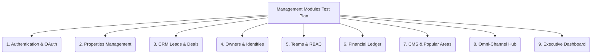

# 📋 Enterprise V3 Ultimate: Comprehensive Management Modules Test Plan (OAuth to Analytics)

**Document Version:** 1.1.0  
**Date:** May 18, 2026  
**Target Environment:** Localhost (`http://localhost:3000`) & Staging / Production  
**Primary Focus:** End-to-End Manual & Surgical Testing across all 9 Management Modules (Starting from Google OAuth & Auth Flow) under both Single-Branch (ปิดสาขา) and Multi-Branch (เปิดสาขา) operational modes.

---

## 🎯 1. วัตถุประสงค์และภาพรวมการทดสอบ (Executive Summary & Objectives)

แผนการทดสอบฉบับนี้ถูกออกแบบมาเพื่อใช้เป็น **"คู่มือการทดสอบระดับพรีเมียม (Master Test Plan)"** สำหรับ Tech Lead, QA, และ System Admin ในการตรวจสอบความถูกต้องของระบบการจัดการ (Management Modules) ทั้งหมดในสถาปัตยกรรม V3

จุดประสงค์หลักคือการยืนยันว่าการทำงานตั้งแต่ **การยืนยันตัวตน (Google OAuth & Role Assignment)**, **Direct V3 Core Mutations (Write)**, ไปจนถึง **Permanent CQRS View Bridge (Read)** สามารถทำงานได้อย่างไร้รอยต่อ ปราศจากข้อผิดพลาด (Zero Runtime Errors) ทั้งในโหมดองค์กรสาขาเดียว (Single-Branch) และโหมดองค์กรหลายสาขา (Multi-Branch) ที่ต้องการการกั้นสิทธิ์ข้อมูล (Tenant & Branch Isolation) ขั้นสูงสุด

---

## ⚙️ 2. การตั้งค่าสภาพแวดล้อมก่อนการทดสอบ (Prerequisites & Mode Toggling)

ก่อนเริ่มการทดสอบในแต่ละโหมด ให้ทำการตั้งค่าระบบผ่านตาราง `system_settings_v3` (หรือเมนูตั้งค่าองค์กรบนหน้า UI) ดังนี้:

```sql
-- 🔴 โหมดที่ 1: Single-Branch Mode (ปิดการจัดการสาขา - โฟกัสที่ Tenant Level)
UPDATE public.system_settings_v3 
SET value = '{"enable_branch_management": false}'::jsonb 
WHERE key = 'org_operational_mode' AND tenant_id = 'YOUR_TENANT_ID';

-- 🔵 โหมดที่ 2: Multi-Branch Mode (เปิดการจัดการสาขา - โฟกัสที่ Branch Isolation)
UPDATE public.system_settings_v3 
SET value = '{"enable_branch_management": true}'::jsonb 
WHERE key = 'org_operational_mode' AND tenant_id = 'YOUR_TENANT_ID';
```

---

## 📊 3. แผนการทดสอบรายโมดูล (Granular Module Test Cases)



---

### 🔑 3.1 Authentication & OAuth Management (ระบบยืนยันตัวตนและ Google OAuth Compliance)
**ตารางหลักที่เกี่ยวข้อง:** `profiles`, `identities_v3`, `tenant_members_v3`

#### 🔴 โหมดปิดสาขา (Single-Branch Mode)
* **Test Case 1 (Google OAuth Signup/Login):** ทำการคลิกปุ่ม "Continue with Google" บนหน้า Login
  * **Expected Result:** ระบบทำการ Redirect ไปยัง Google Consent Screen อย่างถูกต้อง (แสดงโลโก้และชื่อแอปตรงตาม Google Cloud Console) เมื่อยืนยันเสร็จสิ้น ข้อมูลถูกบันทึกลงตาราง `profiles` และ `identities_v3` อัตโนมัติ พร้อมกำหนดสิทธิ์ Default Role เป็น `AGENT` ประจำ Tenant
* **Test Case 2 (Legal Transparency & CSP):** เปิดหน้า Privacy Policy และ Terms of Service
  * **Expected Result:** หน้าเว็บโหลดสำเร็จโดยไม่มีการบล็อกจาก Content Security Policy (CSP) ข้อความนโยบาย PDPA/GDPR (Data Retention, No-Sell Policy) แสดงผลถูกต้องครบถ้วน
* **Test Case 3 (RLS Stack Depth Check):** ล็อกอินและเปิดหน้าแดชบอร์ดหลัก
  * **Expected Result:** ระบบไม่เกิด Error `stack depth limit exceeded` หรือ Infinite Recursion RLS สามารถอ่านข้อมูลโปรไฟล์และ Tenant ได้ทันที

#### 🔵 โหมดเปิดสาขา (Multi-Branch Mode)
* **Test Case 4 (Branch Invitation Link):** ผู้จัดการสาขาส่งลิงก์เชิญ (Invitation Link) ให้พนักงานใหม่เข้าสังกัด "สาขาสุขุมวิท"
  * **Expected Result:** เมื่อพนักงานกดรับคำเชิญและล็อกอินผ่าน Google OAuth ระบบจะทำการผูกเรคคอร์ดใน `tenant_members_v3` เข้ากับ `branch_id` ของสาขาสุขุมวิทโดยอัตโนมัติ
* **Test Case 5 (Cross-Tenant / Cross-Branch Access Attempt):** พนักงานสาขาสุขุมวิทพยายามเข้าถึง URL แดชบอร์ดของสาขาสาทร
  * **Expected Result:** ระบบตรวจจับสิทธิ์ผ่าน JWT / RLS และทำการดีดกลับ (Redirect) ไปยังหน้า Unauthorized หรือหน้าสาขาของตนเองทันที

---

### 🏡 3.2 Properties Management (ระบบจัดการอสังหาริมทรัพย์)
**ตารางหลักที่เกี่ยวข้อง:** `properties_core`, `properties_details`, `property_media_v3`

#### 🔴 โหมดปิดสาขา (Single-Branch Mode)
* **Test Case 1 (Create):** ทำการสร้างอสังหาฯ ใหม่ผ่านฟอร์ม UI โดยไม่ระบุสาขา
  * **Expected Result:** ข้อมูลถูกบันทึกลง `properties_core` โดยมี `tenant_id` ถูกต้อง และ `branch_id IS NULL` (หรือเป็นค่า Default Branch) ข้อมูลแสดงขึ้นตารางรายการทันทีผ่าน View Bridge
* **Test Case 2 (Read/Filter):** ค้นหาอสังหาฯ ด้วยตัวกรองราคา, จำนวนห้องนอน, และสถานะ
  * **Expected Result:** ระบบดึงข้อมูลจาก `properties_core` ผ่าน Surgical Index ได้อย่างรวดเร็วระดับ Sub-millisecond โดยแสดงทรัพย์ทั้งหมดใน Tenant
* **Test Case 3 (Update/Media):** ทำการอัปโหลดรูปภาพใหม่และแก้ไขรายละเอียดคำอธิบาย (Description)
  * **Expected Result:** รูปภาพบันทึกลง `property_media_v3` และคำอธิบายอัปเดตลง JSONB ใน `properties_details` สำเร็จ

#### 🔵 โหมดเปิดสาขา (Multi-Branch Mode)
* **Test Case 4 (Branch Assignment):** สร้างอสังหาฯ ใหม่และระบุสาขาเป็น "สาขาสุขุมวิท" (`branch_id_A`)
  * **Expected Result:** `properties_core.branch_id` ถูกบันทึกเป็น `branch_id_A` อย่างแม่นยำ
* **Test Case 5 (Branch Isolation Read):** ล็อกอินด้วยบัญชีเอเจนท์ที่สังกัด "สาขาสาทร" (`branch_id_B`)
  * **Expected Result:** ตารางรายการอสังหาฯ จะแสดงเฉพาะทรัพย์ของสาขาสาทร (หรือทรัพย์ส่วนกลางที่เปิดแชร์) ทรัพย์ของสาขาสุขุมวิทจะถูกซ่อนโดยอัตโนมัติผ่านระบบ RLS และ CQRS View Bridge Filter
* **Test Case 6 (Admin Override):** ล็อกอินด้วยบัญชี Tenant Admin / ผู้บริหาร
  * **Expected Result:** สามารถมองเห็นทรัพย์จากทุกสาขา และสามารถใช้ Dropdown ตัวกรองเพื่อเลือกดูทรัพย์รายสาขาได้

---

### 💼 3.3 CRM Leads & Deals Pipeline (ระบบบริหารจัดการลูกค้าและโอกาสการขาย)
**ตารางหลักที่เกี่ยวข้อง:** `crm_leads_v3`, `crm_deals_v3`, `activity_timeline_v3`

#### 🔴 โหมดปิดสาขา (Single-Branch Mode)
* **Test Case 1 (Lead Intake):** สร้าง Lead ใหม่ผ่านฟอร์มหรือรับผ่าน Webhook
  * **Expected Result:** บันทึกลง `crm_leads_v3` โดยผูกกับ `tenant_id` ข้อมูลแสดงบนบอร์ด Kanban ทันที
* **Test Case 2 (Deal Progression):** ทำการลากการ์ด Deal จาก Stage "Negotiation" ไปยัง "Closed Won"
  * **Expected Result:** `crm_deals_v3.status` ถูกอัปเดต และระบบสร้างบันทึกประวัติลง `activity_timeline_v3` แบบอัตโนมัติ

#### 🔵 โหมดเปิดสาขา (Multi-Branch Mode)
* **Test Case 3 (Branch Lead Routing):** สร้าง Lead ใหม่และระบุให้เข้าสังกัด "สาขาเชียงใหม่"
  * **Expected Result:** Lead ปรากฏเฉพาะบน Kanban Board ของเอเจนท์และผู้จัดการสาขาเชียงใหม่เท่านั้น
* **Test Case 4 (Inter-Branch Deal Transfer):** ผู้จัดการสาขาทำการโอนย้าย Deal จาก "สาขาเชียงใหม่" ไปให้ "สาขาภูเก็ต"
  * **Expected Result:** `crm_deals_v3.branch_id` ถูกอัปเดต สิทธิ์การมองเห็นและการแก้ไขถูกเปลี่ยนผ่านไปยังทีมสาขาภูเก็ตทันที พร้อมบันทึก Audit Log

---

### 👤 3.4 Owners & Identities Management (ระบบจัดการเจ้าของทรัพย์และผู้ติดต่อ)
**ตารางหลักที่เกี่ยวข้อง:** `identities_v3`, `identity_secrets_v3`

#### 🔴 โหมดปิดสาขา (Single-Branch Mode)
* **Test Case 1 (Create Owner with PII):** สร้างโปรไฟล์เจ้าของทรัพย์พร้อมใส่เลขบัตรประชาชนและเลขบัญชีธนาคาร
  * **Expected Result:** ข้อมูลทั่วไปบันทึกลง `identities_v3` ข้อมูลอ่อนไหว (PII) ถูกเข้ารหัส (Encryption) และบันทึกลง `identity_secrets_v3` (Vault) สำเร็จ
* **Test Case 2 (Owner Search):** ค้นหาชื่อเจ้าของทรัพย์ในช่องค้นหา
  * **Expected Result:** ระบบค้นหาเจออย่างรวดเร็วผ่าน Blind Index Hashing โดยไม่ต้องถอดรหัสข้อมูลทั้งตาราง

#### 🔵 โหมดเปิดสาขา (Multi-Branch Mode)
* **Test Case 3 (Branch Owner Scoping):** เอเจนท์สาขาพัทยาสร้างโปรไฟล์ Owner ใหม่
  * **Expected Result:** โปรไฟล์ Owner ถูกผูกกับ Tenant แต่การเข้าถึงข้อมูลการติดต่อเชิงลึกจะถูกจำกัดสิทธิ์ให้เห็นได้เฉพาะเอเจนท์ในสาขาพัทยา หรือผู้ที่มีสิทธิ์ระดับ Admin
* **Test Case 4 (Cross-Branch Collision Check):** เอเจนท์สาขาหัวหินพยายามสร้าง Owner ที่มีเบอร์โทรศัพท์ซ้ำกับสาขาพัทยา
  * **Expected Result:** ระบบ `identity_sources_map` ตรวจจับความซ้ำซ้อนและทำการแจ้งเตือน (Merge Suggestion) เพื่อป้องกันข้อมูลขยะในระบบ

---

### 🛡️ 3.5 Teams & Tenant Members Management (ระบบจัดการทีมและสิทธิ์พนักงาน)
**ตารางหลักที่เกี่ยวข้อง:** `teams_v3`, `tenant_members_v3`, `branches_v3`

#### 🔴 โหมดปิดสาขา (Single-Branch Mode)
* **Test Case 1 (Team Creation):** สร้างทีมการขายใหม่ (เช่น "ทีมขายบ้านเดี่ยว") และเพิ่มสมาชิกเข้าทีม
  * **Expected Result:** บันทึกลง `teams_v3` และ `tenant_members_v3` สมาชิกทุกคนในทีมสามารถทำงานร่วมกันภายใต้ขอบเขตของ Tenant

#### 🔵 โหมดเปิดสาขา (Multi-Branch Mode)
* **Test Case 2 (Branch Manager Assignment):** กำหนดสิทธิ์ให้ นาย A เป็น "ผู้จัดการสาขา" (Branch Manager) ประจำสาขาสุขุมวิท
  * **Expected Result:** นาย A สามารถดูรายงาน, ดู Leads/Deals, และจัดการสมาชิกทุกคนภายในสาขาสุขุมวิทได้ แต่ไม่สามารถเข้าถึงข้อมูลของสาขาอื่นได้
* **Test Case 3 (Multi-Branch Agent):** กำหนดให้ นาย B สังกัดทั้ง "สาขาสุขุมวิท" และ "สาขาสาทร"
  * **Expected Result:** นาย B สามารถสลับมุมมอง (Branch Switcher) บน UI เพื่อทำงานร่วมกับทั้งสองสาขาได้อย่างสมบูรณ์

---

### 💰 3.6 Financial Ledger & Commissions (ระบบบัญชีและการเงิน)
**ตารางหลักที่เกี่ยวข้อง:** `financial_ledger_v3`, `crm_deal_commissions_v3`

#### 🔴 โหมดปิดสาขา (Single-Branch Mode)
* **Test Case 1 (Deal Closure & Commission):** ทำการปิดดีลการขายและคำนวณคอมมิชชัน 5%
  * **Expected Result:** ข้อมูลบันทึกลง `crm_deal_commissions_v3` และสร้างรายการบันทึกบัญชีแบบ Append-Only ลง `financial_ledger_v3` (บันทึกยอด Gross, Net, WHT 3%, และ VAT อย่างถูกต้องแม่นยำ)

#### 🔵 โหมดเปิดสาขา (Multi-Branch Mode)
* **Test Case 2 (Branch Revenue Attribution):** ปิดดีลการเช่าที่เกิดจากผลงานของ "สาขาภูเก็ต"
  * **Expected Result:** รายการใน `financial_ledger_v3` มีการบันทึก `branch_id` เป็นสาขาภูเก็ต ยอดรายได้ถูกนำไปคำนวณในงบกำไรขาดทุน (P&L) ประจำสาขาภูเก็ตทันที

---

### 📰 3.7 CMS & Popular Areas Management (ระบบจัดการเนื้อหาและย่านยอดนิยม)
**ตารางหลักที่เกี่ยวข้อง:** `cms_content_v3`, `popular_areas_v3`

#### 🔴 โหมดปิดสาขา (Single-Branch Mode)
* **Test Case 1 (Create Popular Area):** สร้างย่านยอดนิยมใหม่ (เช่น "ทองหล่อ") พร้อมใส่ชื่อภาษาไทยและอังกฤษ
  * **Expected Result:** บันทึกลง `popular_areas_v3` ข้อมูลแสดงบนหน้าเว็บหลักทันทีผ่าน Direct V3 Core Join
* **Test Case 2 (Publish Blog Post):** สร้างและเผยแพร่บทความบล็อก
  * **Expected Result:** บันทึกลง `cms_content_v3` พร้อมอัปเดตสถานะการเผยแพร่

#### 🔵 โหมดเปิดสาขา (Multi-Branch Mode)
* **Test Case 3 (Branch-Specific CMS):** สร้างประกาศ/ข่าวสารภายใน (Internal Announcement) สำหรับ "สาขาเชียงใหม่"
  * **Expected Result:** `cms_content_v3.branch_id` ถูกบันทึก ข่าวสารปรากฏเฉพาะบนหน้าแดชบอร์ดของพนักงานสาขาเชียงใหม่เท่านั้น

---

### 💬 3.8 Omni-Channel Communications Hub (ระบบสื่อสารรวมช่องทาง)
**ตารางหลักที่เกี่ยวข้อง:** `communications_hub_v3`, `identities_v3`

#### 🔴 โหมดปิดสาขา (Single-Branch Mode)
* **Test Case 1 (Incoming Message):** จำลองการส่งข้อความจาก LINE OA เข้าสู่ระบบ
  * **Expected Result:** ข้อความถูกบันทึกลง `communications_hub_v3` และเชื่อมโยงกับโปรไฟล์ใน `identities_v3` ทันที เอเจนท์ทุกคนใน Tenant สามารถเห็นและตอบกลับได้

#### 🔵 โหมดเปิดสาขา (Multi-Branch Mode)
* **Test Case 2 (Branch Chat Routing):** ลูกค้าทัก LINE OA และเลือกติดต่อ "สาขาพัทยา" (ผ่าน Rich Menu หรือ Bot Routing)
  * **Expected Result:** `communications_hub_v3.branch_id` ถูกกำหนดเป็นสาขาพัทยา ห้องแชทจะเด้งแจ้งเตือนเฉพาะทีมงานประจำสาขาพัทยาเท่านั้น

---

### 📈 3.9 Executive Dashboard & Analytics (หน้าปัดผู้บริหารและรายงาน)
**ตารางหลักที่เกี่ยวข้อง:** `mv_executive_dashboard`, `branch_daily_snapshots`

#### 🔴 โหมดปิดสาขา (Single-Branch Mode)
* **Test Case 1 (Tenant Overview):** เปิดหน้าแดชบอร์ดผู้บริหาร
  * **Expected Result:** กราฟแสดงยอดขายรวม, จำนวน Leads รวม, และประสิทธิภาพเอเจนท์ของทั้งองค์กร (Tenant) โดยโหลดข้อมูลเสร็จใน 0.01 วินาทีผ่าน Materialized View

#### 🔵 โหมดเปิดสาขา (Multi-Branch Mode)
* **Test Case 2 (Branch Performance Comparison):** เปิดหน้าแดชบอร์ดและเลือกมุมมอง "เปรียบเทียบระหว่างสาขา" (Branch Comparison)
  * **Expected Result:** ระบบดึงข้อมูลจาก `branch_daily_snapshots` มาแสดงกราฟเปรียบเทียบยอดขายระหว่างสาขาสุขุมวิท, สาทร, และเชียงใหม่ได้อย่างแม่นยำ
* **Test Case 3 (Branch Manager View):** ล็อกอินด้วยบัญชีผู้จัดการสาขาสุขุมวิท
  * **Expected Result:** แดชบอร์ดแสดงเฉพาะตัวเลขสถิติและเป้าหมาย (KPIs) ของสาขาสุขุมวิทเท่านั้น

---

## 📝 4. เกณฑ์การประเมินและบันทึกผลการทดสอบ (Sign-off Criteria)

ในการทดสอบจริง ให้ผู้ทดสอบทำการบันทึกผลลัพธ์ลงในตารางด้านล่างเพื่อใช้เป็นหลักฐานในการ Sign-off ขึ้นสู่ Production:

| Module Name | Single-Branch Status | Multi-Branch Status | Tested By | Date | Notes / Observations |
| :--- | :---: | :---: | :---: | :---: | :--- |
| **1. Authentication & OAuth**| ⬜ Pass / ⬜ Fail | ⬜ Pass / ⬜ Fail | ____________ | ____/____ | ________________________ |
| **2. Properties Management** | ⬜ Pass / ⬜ Fail | ⬜ Pass / ⬜ Fail | ____________ | ____/____ | ________________________ |
| **3. CRM Leads & Deals** | ⬜ Pass / ⬜ Fail | ⬜ Pass / ⬜ Fail | ____________ | ____/____ | ________________________ |
| **4. Owners & Identities** | ⬜ Pass / ⬜ Fail | ⬜ Pass / ⬜ Fail | ____________ | ____/____ | ________________________ |
| **5. Teams & RBAC** | ⬜ Pass / ⬜ Fail | ⬜ Pass / ⬜ Fail | ____________ | ____/____ | ________________________ |
| **6. Financial Ledger** | ⬜ Pass / ⬜ Fail | ⬜ Pass / ⬜ Fail | ____________ | ____/____ | ________________________ |
| **7. CMS & Popular Areas** | ⬜ Pass / ⬜ Fail | ⬜ Pass / ⬜ Fail | ____________ | ____/____ | ________________________ |
| **8. Omni-Channel Hub** | ⬜ Pass / ⬜ Fail | ⬜ Pass / ⬜ Fail | ____________ | ____/____ | ________________________ |
| **9. Executive Dashboard**| ⬜ Pass / ⬜ Fail | ⬜ Pass / ⬜ Fail | ____________ | ____/____ | ________________________ |

**🟢 สถานะความพร้อม:** แผนการทดสอบนี้สอดคล้องกับโครงสร้าง V3 Ultimate Greenfield 100% พร้อมใช้งานสำหรับการทดสอบบน `localhost:3000` และ Staging Environment ทันที! 🚀
