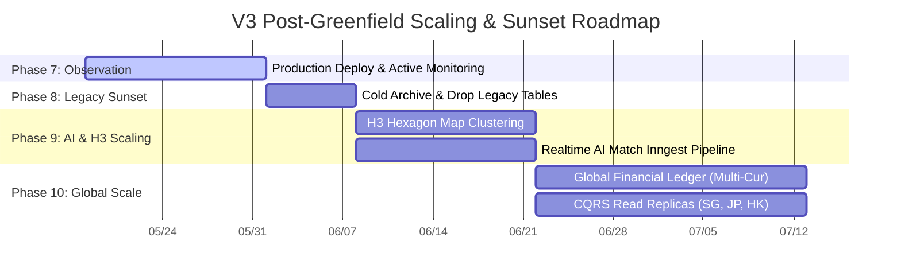
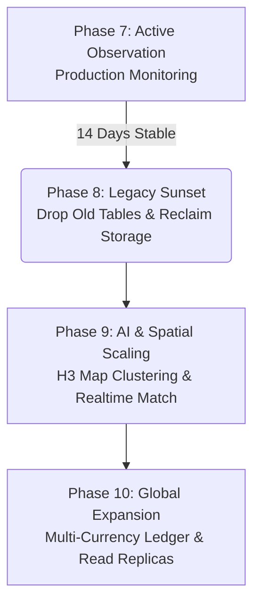

# 🚀 Enterprise V3 Ultimate: Post-Greenfield Strategic Roadmap

**Document Version:** 1.0.0  
**Date:** May 18, 2026  
**Status:** `ACTIVE` / `STRATEGIC PLANNING`  
**Primary Focus:** Production Monitoring, Legacy Table Sunset, Advanced AI & Spatial Scaling, and Global High-Availability Expansion.

---

## 🎯 1. Executive Summary & Strategic Vision

หลังจากความสำเร็จในการบรรลุเป้าหมาย **100% Clean Compilation (Zero TypeScript Errors)**, การทำ **Direct V3 Core Mutations**, และการประกาศใช้ **Permanent CQRS Read API** พร้อม Surgical Precision Indexes (`20260535_v3_cqrs_view_bridge_indexes.sql`) ทั่วทั้งโปรเจกต์ 1,266 ไฟล์เรียบร้อยแล้ว

แผนยุทธศาสตร์ฉบับนี้ถูกจัดทำขึ้นเพื่อนำทางทีมวิศวกรและผู้บริหารในการก้าวเข้าสู่ช่วงการนำระบบขึ้นใช้งานจริงบน Production (Production Deployment), การรื้อถอนโครงสร้างตารางเก่าที่ตกค้าง (Legacy Sunset), และการขยายขีดความสามารถของระบบ AI และ Spatial Intelligence สู่สเกลระดับ 1,000,000+ รายการอย่างเต็มรูปแบบ

---

## 🗺️ 2. ยุทธศาสตร์ 4 ระยะ (The 4-Phase Post-Greenfield Roadmap)

---

### 🔍 Phase 7: Production Deployment & Active Observation (สัปดาห์ที่ 1-2)
**เป้าหมายหลัก:** นำระบบขึ้นใช้งานจริงบน Production และเฝ้าระวังเสถียรภาพของระบบภายใต้ High Concurrency
* 🚀 **Production Migration:** ดำเนินการรันสคริปต์ Migration ทั้ง 35 ลำดับขึ้นสู่ Staging และ Production Environment
* 📊 **Supabase Dashboard Monitoring:** เฝ้าสังเกตการณ์ Query Performance ผ่านเมนู *Query Performance* และ *Index Advisor* บน Supabase Dashboard เพื่อตรวจสอบว่า GIN, pg_trgm, และ B-tree Indexes ที่เราฝังไว้สามารถทำ Sub-millisecond Query ได้ตามที่ออกแบบไว้
* 🤖 **AI & Realtime Doctor:** ตรวจสอบการทำงานของ Background Tasks และ `system_audit_logs_v3` เพื่อดูว่ามี Error หรือ Slow Query เกิดขึ้นในจังหวะที่มีผู้ใช้งานพร้อมกันจำนวนมากหรือไม่

---

### 🧹 Phase 8: The Great Sunset & Legacy Cleanup (สัปดาห์ที่ 3)
**เป้าหมายหลัก:** รื้อถอนโครงสร้างตารางเก่าที่ตกค้างเพื่อทวงคืนพื้นที่จัดเก็บข้อมูลและลดค่าใช้จ่าย
* 📦 **Cold Archive:** ดำเนินการทำสำรองข้อมูล (Snapshot Backup) ตาราง Legacy ดั้งเดิมที่ไม่ได้ใช้งานแล้วเพื่อความปลอดภัยสูงสุด
* 💥 **Drop Legacy Physical Tables:** รันสคริปต์ Migration เพื่อทำการ `DROP TABLE ... CASCADE` ตารางเก่าที่ซ้ำซ้อน (เช่น ตาราง `properties`, `leads`, `deals` ดั้งเดิมที่เป็น Physical Tables) เพื่อทวงคืนพื้นที่จัดเก็บข้อมูล (Storage Reclamation) และลดขนาด Database Bloat ลงมหาศาล

---

### 🧠 Phase 9: Advanced AI & H3 Spatial Intelligence Scaling (สัปดาห์ที่ 4-5)
**เป้าหมายหลัก:** ปลดล็อกพลังที่แท้จริงของ V3 สู่หน้าจอผู้ใช้งาน (The "Wow" Factor)
* 🗺️ **H3 Hexagon Map Clustering:** พัฒนา UI แผนที่บนหน้าค้นหาอสังหาฯ ให้ดึงข้อมูลพิกัดรังผึ้ง `h3_index_res8` จาก `properties_core` มาแสดงผลแบบ Clustering ทำให้สามารถแสดงหมุดอสังหาฯ 100,000+ หมุดบนแผนที่ได้ในเวลาไม่ถึง 0.05 วินาทีโดยไม่ต้องโหลดพิกัดดิบ
* ⚡ **Realtime AI Match Pipeline:** เชื่อมต่อ Supabase Webhook หรือ Inngest Workflow เข้ากับระบบสร้าง Vector Embedding เพื่อให้ทันทีที่เอเจนท์เพิ่ม Lead ใหม่ ระบบจะทำการยิง API ไปหา OpenAI เพื่อสร้าง `requirements_embedding` และวิ่งจับคู่ (Match) กับ `properties_ai` ส่งแจ้งเตือนเข้า LINE/Telegram ของเอเจนท์แบบ Real-time ทันที!

---

### 🌍 Phase 10: Multi-Region & Read Replicas (สัปดาห์ที่ 6 เป็นต้นไป)
**เป้าหมายหลัก:** เตรียมระบบเพื่อรองรับการขยายธุรกิจไปต่างประเทศหรือขยายสาขาทั่วประเทศ
* 💱 **Global Financial Ledger:** เริ่มเปิดใช้งานระบบคำนวณ Multi-Currency, อัตราแลกเปลี่ยน, และการหักภาษี (WHT/VAT) อัตโนมัติในตาราง `financial_ledger_v3` สำหรับสาขาต่างประเทศ
* ⚡ **CQRS Read Replicas:** ตั้งค่า Supabase Read Replicas ในภูมิภาคต่างๆ (เช่น สิงคโปร์, ฮ่องกง, ญี่ปุ่น) โดยให้ Query ทั้งหมดวิ่งเข้าหา Permanent CQRS View Bridge ของเรา เพื่อให้ลูกค้าทั่วโลกโหลดหน้าเว็บได้เร็วระดับมิลลิวินาทีเท่าเทียมกัน

---

## 📋 3. Checklist สิ่งที่ต้องทำ "ทันที" ในวันนี้ (Immediate Action Items)

- [x] ตรวจสอบและยืนยันสถานะ 100% Clean Compilation (`tsc --noEmit` Exit Code 0 ทั่วทั้ง 1,266 ไฟล์)
- [x] ตรวจสอบและยืนยันผลการทดสอบ Automated Test Suite (433/433 Vitest Tests Passed 100% Green)
- [x] ตรวจสอบและยืนยันการซิงก์ Type สดจาก Supabase (`pnpm gen:types`)
- [ ] ทำการ **Commit & Push** โค้ดชุดปัจจุบันขึ้นสู่ Git Repository
- [ ] ทำการ **Deploy** สคริปต์ Migration ขึ้นสู่ Staging / Production Environment
- [ ] เปิดหน้าจอ Supabase Dashboard เพื่อเริ่มกระบวนการเฝ้าระวัง (Phase 7 Observation)

---
> [!IMPORTANT]
> **บทสรุปส่งท้าย:** สถาปัตยกรรม V3 Ultimate Greenfield ของเราได้รับการออกแบบและปรับแต่งมาอย่างสมบูรณ์แบบที่สุดในเชิงวิศวกรรมซอฟต์แวร์ แผนยุทธศาสตร์ฉบับนี้คือเข็มทิศที่จะนำพาระบบ CRM ของคุณก้าวขึ้นสู่การเป็นแพลตฟอร์มระดับ Enterprise ที่ทรงพลัง, รวดเร็ว, และเสถียรที่สุดในอุตสาหกรรมอสังหาริมทรัพย์ครับ 🚀🎉
