# 🌐 V3 Ultimate Architecture Schema

นี่คือภาพรวมของโครงสร้างฐานข้อมูลทั้งหมดที่เราออกแบบในระดับ Enterprise Aggregator ครับ โครงสร้างถูกแบ่งออกเป็น 5 เสาหลัก เพื่อแยกความซับซ้อนและเพิ่มความเร็วในการ Query

## 📊 Entity Relationship Diagram (ERD)

```mermaid
erDiagram
    %% ==================================
    %% 1. Core & Multi-Tenant
    %% ==================================
    TENANTS_V3 ||--o{ BRANCHES_V3 : "has"
    TENANTS_V3 ||--o{ PROPERTIES_CORE : "owns"
    TENANTS_V3 ||--o{ IDENTITIES_V3 : "manages"

    %% ==================================
    %% 2. The Universal User 360
    %% ==================================
    IDENTITIES_V3 ||--|| IDENTITY_SECRETS_V3 : "vault (encrypted)"
    IDENTITIES_V3 ||--o{ IDENTITY_SOURCES_MAP : "linked from (API)"
    DATA_SOURCES ||--o{ IDENTITY_SOURCES_MAP : "provides"

    %% ==================================
    %% 3. The Property Engine (Hot/Cold)
    %% ==================================
    PROPERTIES_CORE ||--|| PROPERTIES_DETAILS : "warm content (JSONB)"
    PROPERTIES_CORE ||--|| PROPERTIES_AI : "cold vector (AI)"
    PROPERTIES_CORE ||--o{ PROPERTY_SYNDICATION_V3 : "syncs to"
    
    DATA_SOURCES ||--o{ RAW_INGESTIONS : "ingests"
    RAW_INGESTIONS }o--o| PROPERTIES_CORE : "processed to"

    %% ==================================
    %% 4. CRM & Omni-Channel
    %% ==================================
    IDENTITIES_V3 ||--o{ CRM_LEADS_V3 : "acts as"
    IDENTITIES_V3 ||--o{ COMMUNICATIONS_HUB_V3 : "chats in"
    IDENTITIES_V3 ||--o{ ACTIVITY_TIMELINE_V3 : "performs"

    %% ==================================
    %% 5. Finance & Media
    %% ==================================
    TENANTS_V3 ||--o{ FINANCIAL_LEDGER_V3 : "records"
    IDENTITIES_V3 ||--o{ FINANCIAL_LEDGER_V3 : "transacts"
    PROPERTIES_CORE ||--o{ DOCUMENTS_V3 : "has documents"

    %% ==================================
    %% 6. CMS, Config & Ops
    %% ==================================
    TENANTS_V3 ||--o{ CMS_CONTENT_V3 : "publishes"
    TENANTS_V3 ||--o{ SYSTEM_SETTINGS_V3 : "configures"
    TENANTS_V3 ||--o{ NOTIFICATIONS_V3 : "alerts"
    IDENTITIES_V3 ||--o{ NOTIFICATIONS_V3 : "receives"

    %% ==================================
    %% 7. RBAC, Media & Audit
    %% ==================================
    TENANTS_V3 ||--o{ TEAMS_V3 : "structures"
    TEAMS_V3 ||--o{ TENANT_MEMBERS_V3 : "contains"
    IDENTITIES_V3 ||--o{ TENANT_MEMBERS_V3 : "assigned to"
    PROPERTIES_CORE ||--o{ PROPERTY_MEDIA_V3 : "displays"
```

---

## 🗄️ โครงสร้างรายตาราง (Table Definitions)

### 🔴 1. THE PROPERTY ENGINE (แยก Hot/Cold Data)
หัวใจหลักของการค้นหาที่เร็วระดับมิลลิวินาที (100k+ Records)

| Table Name | Purpose (หน้าที่) | Key Features |
| :--- | :--- | :--- |
| **`properties_core`** | **[HOT]** ตารางหลักสำหรับ Search & Filter | เก็บเฉพาะ `price`, `bedrooms`, `status`, และ **H3 Index** (พิกัดรังผึ้ง) |
| **`properties_details`** | **[WARM]** ตารางรายละเอียดทรัพย์ | เก็บ `title`, `description` (ทุกภาษา), และ `amenities`, `pricing` (JSONB) |
| **`properties_ai`** | **[COLD]** ตารางสำหรับ AI | เก็บ `vector(1536)` สำหรับทำ Semantic Search ไม่ดึงมาถ้าไม่จำเป็น |

### 🟢 2. THE AGGREGATOR (ระบบคัดกรองข้อมูลจากหลายแหล่ง)
รองรับการดึงข้อมูลจาก DDProperty, LivingInsider หรือเว็บอื่นๆ

| Table Name | Purpose (หน้าที่) | Key Features |
| :--- | :--- | :--- |
| **`data_sources`** | ทะเบียนแหล่งที่มาข้อมูล | เก็บรายชื่อเว็บ API และคะแนนความน่าเชื่อถือ |
| **`raw_ingestions`** | ถังพักข้อมูลดิบแบบ Data Lake | เก็บ JSON Payload ดิบๆ ก่อนนำมาแปลง (กันข้อมูลเก่าพัง) |

### 🔵 3. UNIVERSAL USER 360 (ระบบตัวตนแบบรวมศูนย์)
รวม Owner, Profile, Agent เข้าด้วยกัน และกันข้อมูลซ้ำ

| Table Name | Purpose (หน้าที่) | Key Features |
| :--- | :--- | :--- |
| **`identities_v3`** | โปรไฟล์ส่วนกลาง | เก็บข้อมูลติดต่อทั่วไป (`phone`, `email`) |
| **`identity_secrets_v3`** | ห้องนิรภัย (Vault) | เก็บ `id_card`, `bank_account` เข้ารหัส (PDPA Compliant) |
| **`identity_sources_map`** | The Secret Sauce | ช่วยยุบรวมนายเอ จากเว็บ A และเว็บ B ให้เป็น Identity เดียวกัน |

### 🟠 4. CRM & OMNI-CHANNEL (ระบบขายและการสื่อสาร)
บริหาร Lead และแชทจากทุกแพลตฟอร์ม

| Table Name | Purpose (หน้าที่) | Key Features |
| :--- | :--- | :--- |
| **`crm_leads_v3`** | ระบบจัดการลูกค้า | ฝัง `vector` ความต้องการลูกค้า เพื่อหา Match Score อัตโนมัติ |
| **`communications_hub_v3`** | แชทรวมศูนย์ | รวม `omni_messages` จัดการทั้ง LINE, FB ในตารางเดียว |
| **`activity_timeline_v3`** | ประวัติการทำงาน | เก็บทุก Action (โทร, ดูบ้าน, นัดหมาย) แบบ Polymorphic |

### 🟣 5. FINANCE & ANALYTICS (การเงินและสถิติ)
โปร่งใส ห้ามโกง และโหลดเร็วสุด

| Table Name | Purpose (หน้าที่) | Key Features |
| :--- | :--- | :--- |
| **`financial_ledger_v3`** | บัญชีรับ-จ่าย (Immutable) | บันทึกแก้ไม่ได้ ห้ามลบ แทนที่ `invoices` และ `deal_commissions` |
| **`mv_executive_dashboard`** | หน้าปัดผู้บริหาร | เป็น **Materialized View** ที่สรุปยอดล่วงหน้า โหลดแสนเรคคอร์ดใน 0.01 วิ |
| **`documents_v3`** | ระบบเอกสารและ E-Sign | จัดการสัญญา เก็บ `esign_envelope_id` จาก DocuSign/SignNow |

### 🟡 6. CMS, CONFIG & OPS (ระบบจัดการเนื้อหาและหลังบ้าน)
รวมทุกตารางระบบหลังบ้าน เพื่อให้การจัดการง่ายและลดความซ้ำซ้อน

| Table Name | Purpose (หน้าที่) | Key Features |
| :--- | :--- | :--- |
| **`cms_content_v3`** | ระบบเนื้อหาหลัก | ใช้โครงสร้างเดียวกันทั้ง Blogs, FAQs, Services รองรับ JSONB ทุกภาษา |
| **`system_settings_v3`** | ระบบตั้งค่า | รวบรวม Settings ทั้งหมดของแต่ละ Tenant ไว้ในที่เดียว (ลดตารางแยก) |
| **`notifications_v3`** | แจ้งเตือนอัจฉริยะ | แทร็กการอ่านข้อความและแจ้งเตือนจากระบบสู่นายหน้า |
| **`system_task_queue`** | ตัวจัดการ Cron Job | ถังพักงานพื้นหลัง (Background Ops) ป้องกันเว็บล่มเวลา Process หนักๆ |

### 🛡️ 7. RBAC, MEDIA & AUDIT (สิทธิ์, รูปภาพ, และการแกะรอย)
เติมเต็มส่วนที่สำคัญที่สุดของ Enterprise: การคุมสิทธิ์และประวัติการกระทำ

| Table Name | Purpose (หน้าที่) | Key Features |
| :--- | :--- | :--- |
| **`teams_v3` / `tenant_members_v3`** | ระบบคุมสิทธิ์พนักงาน (RBAC) | กำหนดบทบาท (Role) และสิทธิ์แยกย่อย (Permissions) แทนที่ระบบเก่า |
| **`property_media_v3`** | แกลเลอรีรูปภาพ/วิดีโอ | แทร็กสถานะ AI สแกนรูป (หาลายน้ำ/ป้ายโฆษณาผิดกฎ) และจัดการลำดับรูป |
| **`system_audit_logs_v3`** | แกะรอยการทำงาน (Audit) | เก็บว่าใครแก้ข้อมูลอะไร พร้อมทำ Partition แยกรายเดือนกันฐานข้อมูลบวม |
| **`traffic_views_v3`** | นับยอดวิว (Traffic) | รวมยอดวิว Property, Blog, Service ไว้ที่เดียว (Partitioned) |

---

## 📌 สรุปสถานะการนำไปใช้งานจริง (Implementation & Git Status - ประเมินตามจริง ไม่อวย)

1. **Database Schema & Migrations**: โครงสร้างตาราง V3 ทั้งหมด 20+ ตาราง รวมถึง **Zero-Downtime View Bridge** ถูกสร้างเสร็จสมบูรณ์ในฐานข้อมูลผ่านสคริปต์ Migration (`20260512...` ถึง `20260534...`)
2. **TypeScript & Type Safety**: ระบบผ่านการตรวจสอบ Type ด้วย `tsc --noEmit` ได้ **100% Clean (Exit Code 0)** โดยใช้ `lib/database.types.ts` เป็น Wrapper เชื่อมต่อ View Bridge
3. **Data Mutation & Git Working Tree**: 
   - 🟢 **Direct V3 Core Mutations (100% Completed)**: UI Components และ Form Mutations ทั้งหมด (เช่น `PropertyForm.tsx`, `LeadForm.tsx`, `KanbanBoard.tsx`, `Deals`) ได้ถูกย้ายไปบันทึกข้อมูลลงตารางหลัก V3 โดยตรง (`properties_core`, `properties_details`, `property_media_v3`, `crm_leads_v3`, `crm_deals_v3`) ผ่าน Server Actions และระบบ Scoped Proxy Client สำเร็จ 100%
   - 🟢 **Phase 7 Observation Period**: ระบบเข้าสู่ช่วงการเฝ้าระวัง (Observation Period) 1-2 สัปดาห์ผ่าน `ai-monitor` และ `realtime-doctor` ก่อนทำการลบตารางและ View เก่า (Sunset V1/V2)
   - 📦 **Git Staging Status**: ไฟล์ที่แก้ไข 90+ ไฟล์และไฟล์ใหม่ 45+ ไฟล์พร้อมสำหรับการ Commit ขึ้นระบบ Production
